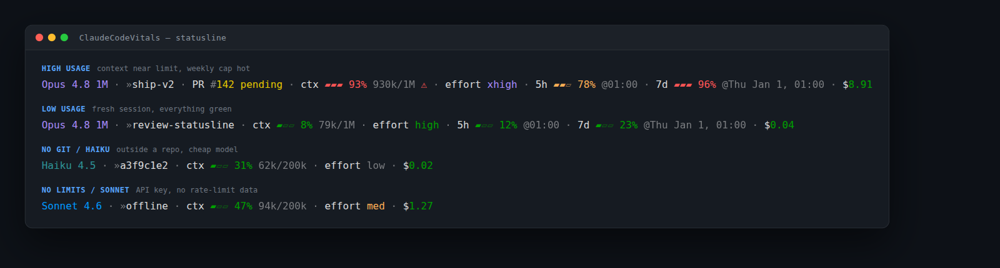

# ClaudeCodeVitals: a beautiful Claude Code statusline

[](https://github.com/BryanBradfo/ClaudeCodeVitals/actions/workflows/ci.yml)

A custom **[Claude Code](https://claude.com/fr/product/claude-code) statusline** with live progress bars for context,
rate limits, and cost, plus model-aware accents, rich git, PR status, and a
session reminder. Single Bash script, Linux, no Nerd Font required.



<sub>Four sample states rendered from `samples/run.sh`: context near limit, a
fresh session, no-git on Haiku, and an API key with no rate-limit data.</sub>

## Segments

Rendered on two lines: a dense info line, then a workspace line with git and
the session name:

```text
model · pr · ctx · effort · 5h · 7d · extra · cost
git · »session
```

- **model**: accent-colored by family (Opus/Sonnet/Haiku)
- **git**: `dir@branch`, dirty `*`, `↑/↓` vs upstream, `+/-` diffstat; opens the second line
- **session**: your `/rename`d session name (else a short id), after git on the second line so a long name never crowds the info
- **pr**: PR number + review state (auto-hidden off a PR)
- **ctx**: context bar + %, turns red with ⚠ above 90%
- **effort**: reasoning effort
- **5h / 7d**: rate-limit bars with reset times
- **extra**: overage credits ($used/$limit) when enabled
- **cost**: session cost from Claude Code's reported usage

## Requirements

Linux or macOS, `jq`, `curl`, `git`, GNU coreutils. Claude Code with OAuth
(Pro/Max) for rate-limit and extra-usage data.

On **macOS**, install GNU coreutils so the script finds `gdate`/`gstat` (it
uses `date -d`/`stat -c`, which BSD lacks) and reads the OAuth token from the
Keychain:

```bash
brew install coreutils
```

## Install

Clone the repo and run the installer; it points `statusLine` at the script in
your `~/.claude/settings.json`, preserving any other keys and backing up the
existing file first:

```bash
git clone https://github.com/BryanBradfo/ClaudeCodeVitals.git
cd ClaudeCodeVitals
./install.sh
```

This points `statusLine` at the script inside the clone, so a `git pull` keeps
your status line up to date. If you'd rather the status line survive deleting
the clone, install a standalone copy into your config dir instead:

```bash
./install.sh --copy   # copies statusline.sh into ~/.claude and points there
```

Prefer to wire it up by hand? Point your `~/.claude/settings.json` at the script:

```json
{ "statusLine": { "type": "command", "command": "/absolute/path/to/statusline.sh" } }
```

Either way, restart Claude Code (or start a new session) to see it.

## Configuration

Edit the CONFIG header in `statusline.sh`: palette, bar glyphs/width,
separator, and per-segment on/off toggles (also overridable via env, e.g.
`SEG_PR=0`).

## Testing

`bash tests/run_tests.sh` runs unit + integration tests.
`bash samples/run.sh` renders sample fixtures for visual review.
